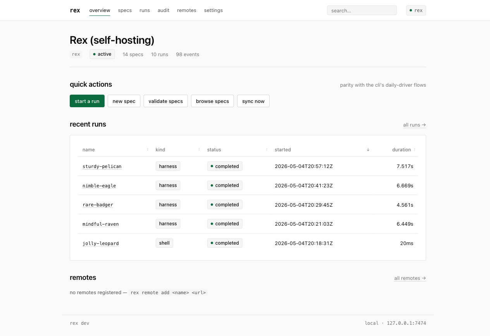
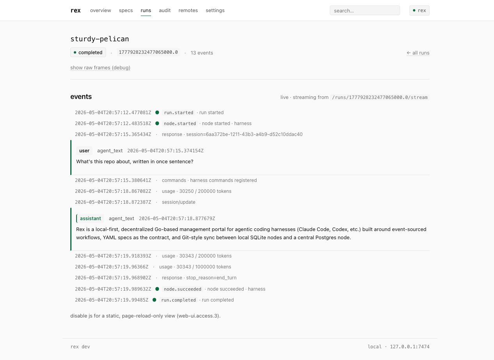
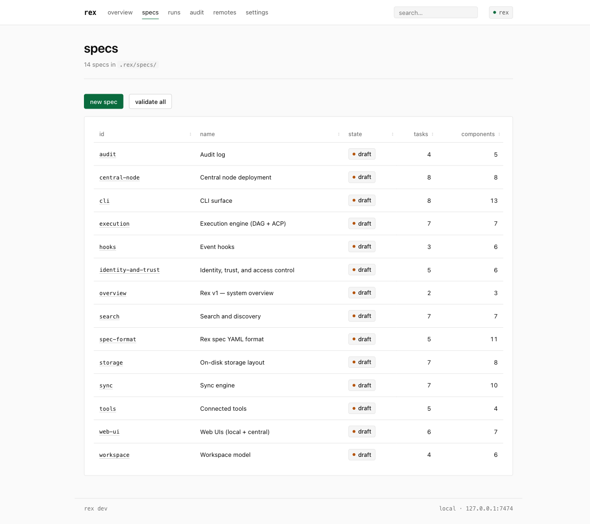
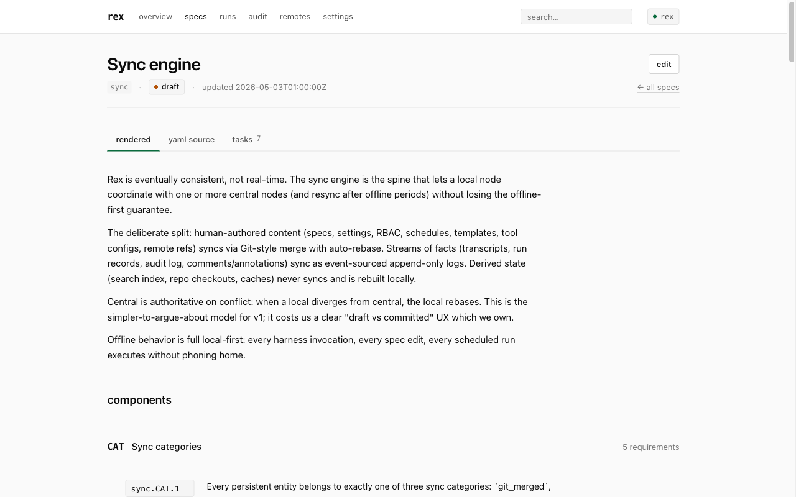
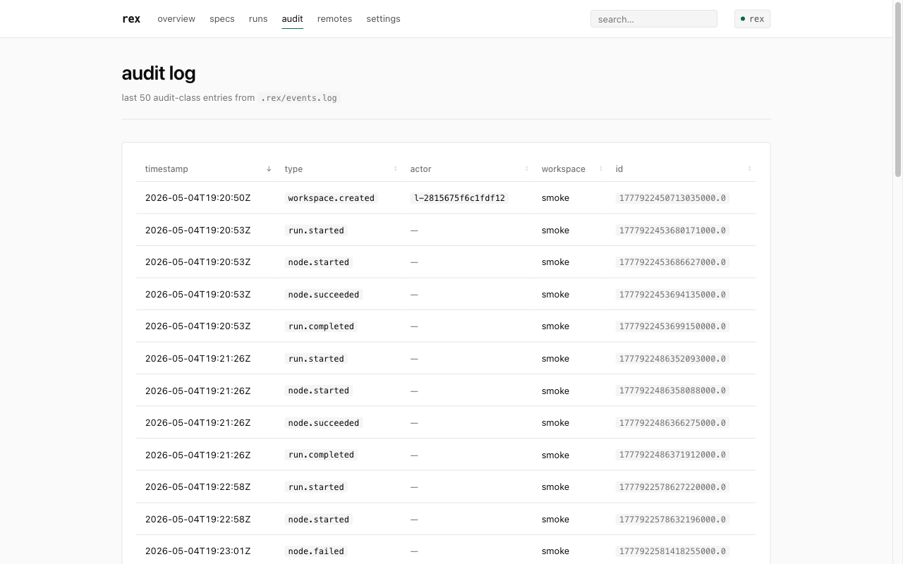
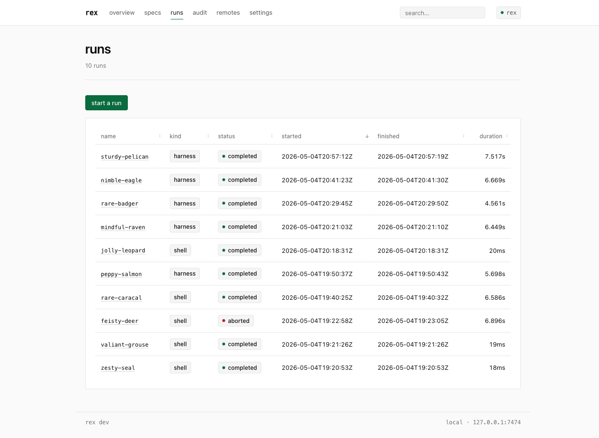

# Rex

**A local-first, decentralized portal for agentic coding harnesses.**
Run Claude Code, Codex, OpenCode, and friends through one CLI, one event log, and one embedded web UI — with optional sync to a central node when you want shared auditability across machines or teammates.

[](https://github.com/asabla/rex/actions/workflows/ci.yml)
[](https://pkg.go.dev/github.com/asabla/rex)
[](LICENSE)
[](go.mod)

> ⚠️ **Pre-1.0.** v1 is daily-driveable, but the spec contract is still in `draft`. Schema is additive-only (`overview.SYS.4`), so events written today will still load tomorrow — but command surfaces and YAML keys may shift before 1.0.



---

## What it is

- **One control plane for every agentic harness you use.** Specs, runs, transcripts, audit log, and search live in *your* workspace, not in a vendor's cloud.
- **Local-first, offline-correct.** Every harness invocation, spec edit, and scheduled run executes against SQLite; remote dependence is a UX degradation, never a correctness one (`overview.SYS.6`).
- **Event-sourced and replayable.** Runs are a fold over an append-only log. The web UI and the CLI read the same events. The audit log is the same log.
- **Specs as the contract.** Acceptance criteria live in versioned YAML with stable IDs you can cite from commits, PRs, and tests (e.g. `sync.ORDER.3`).

## What it isn't (yet)

Captured here so you don't ask for the wrong thing — and so contributors don't burn cycles building it before v1.5:

- ❌ Central-side execution (deferred to v1.5; v1 runs locally only)
- ❌ Worktree-based concurrency (serial-per-workspace in v1)
- ❌ Tool-call audit proxy (direct ACP `session/new` mcpServers)
- ❌ Embeddings / semantic search (FTS5 only)
- ❌ Pre-event gating hooks (post-event observers only)
- ❌ Hardware-backed key storage (software ed25519; signer interface leaves room)

Full list in [`overview.SCOPE.*`](specs/overview.yaml).

---

## Install

Two binaries: `rex` (the local CLI + embedded web UI) and `rex-central` (the in-process central node, optional).

```sh
# From source — pure Go, no cgo, builds offline
git clone https://github.com/asabla/rex.git && cd rex
make install           # → $GOBIN/rex, $GOBIN/rex-central
```

Or grab `make build` to drop binaries into `./bin/` without polluting your `GOBIN`.

Requires Go 1.25+. Local persistence is SQLite via `modernc.org/sqlite` (no system libs). Central persistence is Postgres 17 (recommended; 16 works) or in-memory for ephemeral demos.

## 60-second quickstart

```sh
# 1. Bootstrap a workspace at the current directory.
rex init

# 2. Author a spec from the template, then validate it.
rex spec create my-feature
rex spec validate                       # validates every spec in .rex/specs/

# 3. Run something — a one-shot shell command, or a harness via ACP.
rex run start --shell "echo hello rex"
rex run list

# 4. Browse it in the embedded web UI (loopback-only, no auth).
rex serve                                # → http://127.0.0.1:7474
```

Output of the steps above:

```text
$ rex status
workspace:   rex (Rex (self-hosting)) at /Users/you/code/rex-demo
state:       active
specs:       14
hooks:       0
schedules:   0
events:      102 total
current run: none
remotes:     none (run `rex remote add <name> <url>` to attach)

$ rex spec validate
ok

14 spec(s) validated, 0 error(s), 0 warning(s)

$ rex run start --shell "echo hello rex"
2026-05-04 23:45:44.393  run.started             run=curious-giraffe
2026-05-04 23:45:44.400  node.started            node=shell
2026-05-04 23:45:44.407  node.succeeded          node=shell
2026-05-04 23:45:44.412  run.completed           run=curious-giraffe status=completed
run curious-giraffe (1777931144393679000.0): completed
```

To attach to a central node for shared dispatch and audit:

```sh
rex remote add primary https://central.example.invalid
rex push                  # pushes drafts past the per-remote watermark
rex pull                  # pulls authoritative events from primary
rex sync                  # pull then push, the daily-driver shortcut
```

Every command supports `--json` for piping into `jq`, and `--quiet` for use in CI.

---

## What you get

### A workspace overview that's actually informative


Spec count, run count, event count, recent activity, remotes — at a glance, with quick actions that mirror the CLI's daily-driver flows.

### A run detail view that streams events live



Events arrive over SSE as the run executes. User prompts and assistant replies render as typed cards; harness frames render as audit-grade rows. Toggle the "raw frames (debug)" view when you need to see the wire bytes. The page degrades gracefully without JavaScript (`web-ui.ACCESS.3`) — turn JS off and you get a static, page-reload-only view of the same events.

### Specs you can author, validate, and browse in-place



The 14 v1 specs ship with the repo. They are valid YAML, valid against `spec-format.yaml`, and rendered as readable docs in the UI.



Switch between the rendered view, raw YAML, and the task list. Every requirement has a stable ACID (e.g. `sync.CAT.1`) you can cite from commits, PR descriptions, and tests.

### A real audit log, not a Sentry feed



Append-only, signed with your ed25519 identity (when configured), queryable from the CLI (`rex log tail --type run.completed --since 24h`) and the UI. Schema evolution is additive only — readers skip unknown event types rather than erroring (`overview.SYS.3`).

### A run list that doesn't lie about state



Sort by started/finished/duration. `aborted` is a first-class status, not a missing-end-event mystery. Click any name to drop into the detail view.

---

## How it works

Three sentences:

1. **Specs are YAML in `specs/`** with versioned ACIDs (`<spec.id>.<COMPONENT>.<requirement-id>`). `rex spec validate` enforces the schema in `spec-format.yaml`; CI fails on any error or warning.
2. **Runs are a fold over an event log.** The executor writes typed events (`run.started`, `node.started`, `harness.frame`, `node.succeeded`, `run.completed`, …) to SQLite. The UI and CLI both read the same log; the run detail view tails it live over SSE.
3. **Sync splits state by category** (`overview.SYS.2`). Human-authored content (specs, settings, RBAC, schedules) git-merges. Streams of facts (transcripts, run records, audit) sync as event-sourced append-only logs. Derived state (search index, repo checkouts, caches) is per-node and rebuilt locally — never synced.

Harnesses speak [ACP](https://github.com/anthropic-experimental/acp) (Agent Client Protocol). Tools speak [MCP](https://modelcontextprotocol.io/). Identity is ed25519 + handle, Git-spirit (per-remote trust); there is no password auth (`overview.SEC.4`).

For the long form, read [`specs/overview.yaml`](specs/overview.yaml) first, then the spec for whatever subsystem you're touching.

---

## Architecture at a glance

| Layer | Choice | Why |
| --- | --- | --- |
| Language | Go 1.25, one module, shared core | Differences live behind build tags or a thin shell, never in core (`overview.SYS.1`) |
| Local persistence | SQLite + FTS5 (pure-Go, no cgo — `overview.ENG.2`) | Single-file, durable, no daemon |
| Central persistence | Postgres 17 + Postgres FTS | RLS for multi-tenant isolation, `pg_dump` for backups |
| Transport | HTTPS + Server-Sent Events | No plaintext fallback (`overview.SEC.3`) |
| Harness protocol | ACP (Agent Client Protocol) | Vendor-neutral; works with Claude Code, Codex, OpenCode, … |
| Tool protocol | MCP (Model Context Protocol) | Direct `session/new` mcpServers in v1 |
| Workflow engine | Embedded, event-sourced (~3k LOC) | Engine = fold over event log; trivial to replay |
| Identity | ed25519 keypair + handle, per-remote trust | No passwords, no shared secrets |
| Sync model | Git-style merge for content; append-only log for facts | Conflicts are explicit and auditable |
| Conflict authority | Central authoritative; local rebases on reconnect | The simpler model to argue about for v1 |

## Repository layout

```
cmd/                          # main packages
  rex/                        # local CLI + embedded web UI
  rex-central/                # central node (HTTP server + Postgres)
internal/
  core/                       # shared core (event log, executor, ACP, MCP, search, sync, audit, identity)
  local/                      # local-only: CLI commands, web UI, sync client, remotes registry
  central/                    # central-only: HTTP server, Postgres store, RLS, backup
specs/                        # 14 v1 specs (the contract)
  _proposed/                  # spec amendments awaiting human signoff
deploy/                       # Dockerfile, docker-compose for the central node
```

---

## Documentation

| If you want to… | Read… |
| --- | --- |
| Understand the system in 10 minutes | [`specs/overview.yaml`](specs/overview.yaml) |
| Author or amend a spec | [`specs/spec-format.yaml`](specs/spec-format.yaml) (the format describes itself) |
| Know what syncs and how | [`specs/sync.yaml`](specs/sync.yaml) |
| Run a harness via ACP | [`specs/execution.yaml`](specs/execution.yaml) |
| Stand up a central node | [`specs/central-node.yaml`](specs/central-node.yaml) + [`deploy/`](deploy/) |
| Add a hook | [`specs/hooks.yaml`](specs/hooks.yaml) |
| Find your way around the CLI | `rex help` and `rex <noun> --help`, plus [`specs/cli.yaml`](specs/cli.yaml) |
| Contribute | [`CLAUDE.md`](CLAUDE.md) — read order, rules of engagement, commit format |

The full read order:

1. `specs/overview.yaml` — system-wide invariants, scope cuts, naming
2. `specs/spec-format.yaml` — the YAML schema all specs use (it describes itself)
3. `specs/identity-and-trust.yaml` — keypairs, handles, orgs, RBAC
4. `specs/workspace.yaml` — workspace model, repos, work types, states
5. `specs/storage.yaml` — on-disk layout, registry, snapshots, encryption
6. `specs/sync.yaml` — what syncs and how (Git-style merge + event-sourced split)
7. `specs/execution.yaml` — DAG executor, ACP harness invocation, runs
8. `specs/search.yaml` — indexing, FTS, gitignore-awareness
9. `specs/tools.yaml` — MCP servers and app-level integrations
10. `specs/hooks.yaml` — file-based event observers
11. `specs/audit.yaml` — append-only audit log, retention, compaction
12. `specs/central-node.yaml` — Docker Compose deployment, multi-tenancy
13. `specs/cli.yaml` — `rex` command surface
14. `specs/web-ui.yaml` — local + central htmx UIs

---

## Status & roadmap

- ✅ **v1 trunk shipped.** All six trunk steps (ACP client, executor, spec validator, CLI + hooks, sync, snapshots) plus search, identity + audit, and the embedded web UI are merged and daily-driveable.
- 🔄 **Spec state.** Every spec is `metadata.state: draft`. Reviewing and flipping to `active` is the v1.0 gate.
- 🔜 **v1.5.** Central-side execution, worktree concurrency, optional tool-call audit proxy.

CI: build, vet, race tests, `go mod tidy` drift, golangci-lint. Pure Go, builds and tests on Linux + macOS.

## Security

- **No password auth.** Identity is ed25519 keypair + handle (`overview.SEC.4`).
- **No plaintext transport.** HTTPS + SSE only between local and central (`overview.SEC.3`).
- **No cgo in the local binary** (`overview.ENG.2`) — narrower attack surface, easier reproducible builds.
- **Append-only audit log**, signed with your local identity when configured.
- **RLS at the DB layer** on the central node — even if app code forgets the `WHERE` clause, the row-level policy catches it.

If you find a vulnerability, please open a private security advisory on GitHub rather than a public issue.

## Contributing

Read [`CLAUDE.md`](CLAUDE.md) first — it is the rules of engagement (one task per PR, cite ACIDs in commits, don't silently edit specs, no new runtime deps without justification). Open issues and PRs on [github.com/asabla/rex](https://github.com/asabla/rex).

## License

[MIT](LICENSE) — © 2026 Emil.
